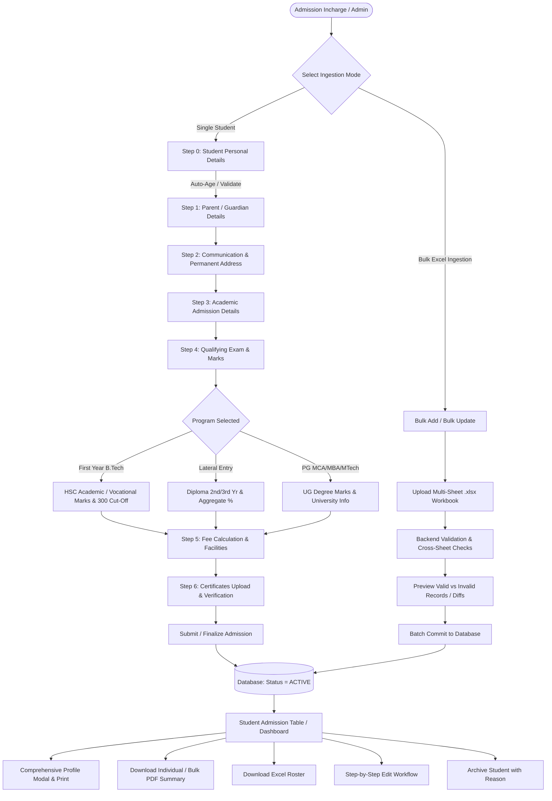
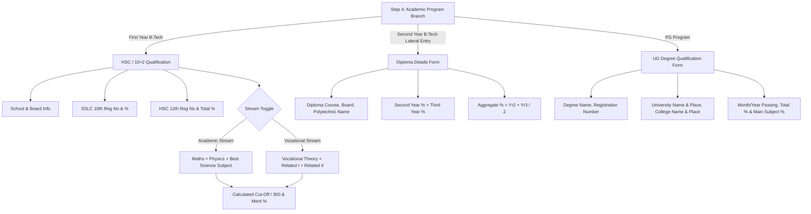
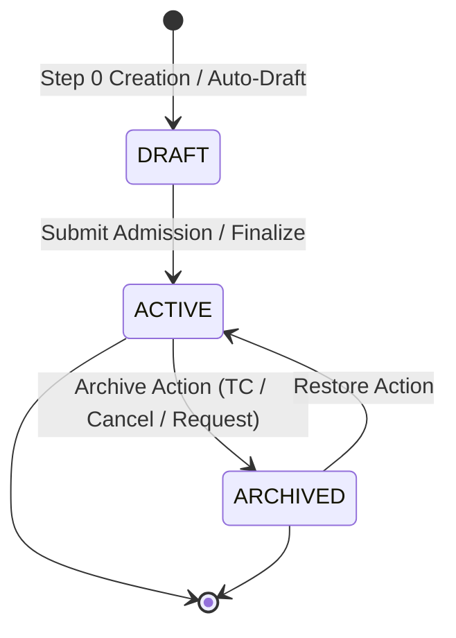
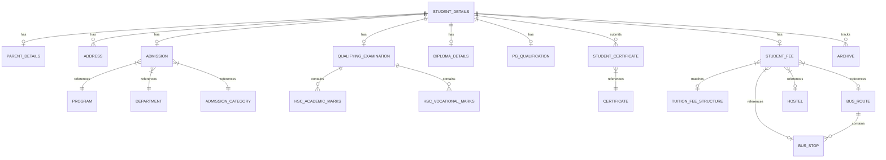
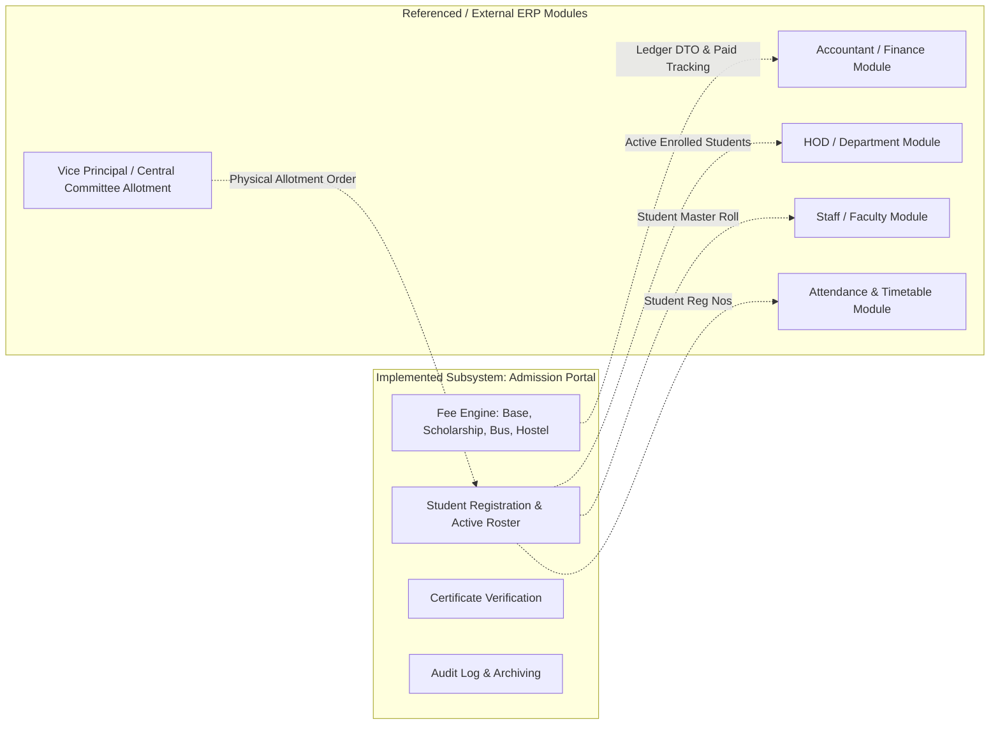

# College ERP — Admission Portal System Requirements & Implementation Specification

> **Document Version:** 1.0.0  
> **Source Base:** Rajiv Gandhi College of Engineering & Technology (RGCET) — Academic ERP System  
> **Target File:** `Admission_Portal_Requirements.md`  
> **Document Purpose:** Complete functional and technical requirements extraction reflecting the *exact implemented reality* of the Admission Portal codebase. No assumptions, redesigns, or hypothetical workflows are introduced. All features are classified based on their concrete presence in frontend components, backend controllers, JPA entities, database schema definitions, calculation engines, and configuration files.

---

## Status Classification Legend
To maintain technical accuracy and distinguish actual code implementations from roadmap references:
- `[IMPLEMENTED]` — Fully implemented in both frontend UI/UX and backend API/database layers.
- `[INCOMPLETE]` — Partially implemented (e.g., UI exists with mock fallbacks, or backend entity fields exist without dedicated UI controls).
- `[REFERENCED]` — Mentioned in documentation, naming conventions, or architectural comments, but not backed by functional endpoints or tables.
- `[NOT FOUND]` — Explicitly verified as absent from the current codebase.

---

## 1. Portal Overview

### 1.1 Purpose & Scope `[IMPLEMENTED]`
The **Admission Portal** is the central academic enrollment subsystem of the Rajiv Gandhi College of Engineering & Technology (RGCET) ERP. It handles the complete lifecycle of student onboarding from initial registration through 7 distinct configuration steps (Personal, Parent, Communication, Academic, Qualifying Exam / Marks, Fee Structure & Transport / Hostel Facilities, Certificate Upload / Verification) to active student roster management, document viewing, printing, PDF generation, bulk spreadsheet ingestion, updates, and soft-delete archiving.

### 1.2 Tech Stack & Architecture `[IMPLEMENTED]`
- **Frontend:** React 18 (TypeScript), Vite, Material-UI (MUI v5), Emotion, Lucide React icons, Zod schemas, React Hook Form (or Context-driven custom forms), React Router DOM (v6), jsPDF + jsPDF-AutoTable, XLSX (SheetJS).
- **Backend:** Java 17, Spring Boot 3.x, Spring Data JPA, Hibernate, PostgreSQL driver, Jakarta Validation, Lombok, Apache POI / CSV parsers for bulk ingestion.
- **Database:** PostgreSQL (Database name: `erp_admission`, default port: `5432`).
- **Storage:** Local multipart file upload directory (`uploads/` or configurable via `app.upload-dir`) serving certificates and document scans.

---

## 2. Admission Portal Roles and Responsibilities

### 2.1 Current Role Implementation `[IMPLEMENTED]`
- **Single Authenticated Administrative Role (`Administrator` / `ADMIN USER`):**
  - Managed via `AdminProfile` entity (`admin_profile` table) and `AdminProfileController` (`/api/profile`).
  - Has full permissions across all admission actions: student enrollment, student record editing, certificate uploads/deletion, PDF summary downloads, Excel exports, bulk Excel adds/updates, student archiving, and student restoration.
  - Can configure administrative credentials (Admin Full Name, Username, Current Password, New Password) via `/settings`.

### 2.2 Role-Based Access Control (RBAC) Status
- `[IMPLEMENTED]`: Single Admin profile with database persistence and localStorage sync (`rgcet_admin_name`, `rgcet_admin_username`).
- `[REFERENCED]`: Multi-user role column `role` exists in `admin_profile` entity, but role-based guards or multi-role permission hierarchies (e.g., separate Clerk vs. HOD vs. Principal permissions) are not implemented in the current API/UI security filters.
- `[NOT FOUND]`: Student self-registration portal, Student self-login credentials, or Parent portal logins.

---

## 3. Complete Admission Workflow

### 3.1 Step-by-Step Single Admission Wizard Lifecycle `[IMPLEMENTED]`
1. **Initiation:** User navigates to `/admission` (Add Student). The system initializes an in-memory draft (`currentDraft`) or loads an existing local draft from `localStorage` (`admission_draft_new`).
2. **Sequential Step Progression:** The user navigates through 7 linear steps (indexed 0 to 6). Navigation forward is enabled when step validation passes or can be freely navigated via the active Step Navigation Sidebar.
3. **Draft Auto-Saving:** Every keystroke updates `currentDraft` in React Context and persists to `localStorage` under `admission_draft_new` (or `admission_draft_edit_<id>` during edits) with a 2-second debounce timer.
4. **Unsaved Changes & Discard Dialogs:** If dirty form state is detected, attempting to leave routes triggers a confirmation modal (`ConfirmationDialog`) with "Keep Editing" or "Discard" actions.
5. **Final Submission:**
   - On Step 6 (Certificates), clicking **"Submit Admission"** triggers `/api/students/submit` or single-step REST updates followed by `/api/students/{id}/finalize`.
   - The student record status is updated to `ACTIVE`.
   - Draft keys are wiped from `localStorage`.
   - The user is redirected to the Dashboard (`/`) with a success notification.

---

## 4. How Students Enter the Admission Portal

Students enter the Admission Portal through exactly three concrete mechanisms:

1. **Direct Single Admission Entry (`/admission`) `[IMPLEMENTED]`:**
   - Manual entry through the 7-step interactive wizard by the Admission Incharge/Admin.
   - Generates or takes an Application Number (e.g., `RGCET/2026/2001`) and optional Register Number (e.g., `26BTECH001`).

2. **Bulk Excel Admission Ingestion (`/bulk-add-admission`) `[IMPLEMENTED]`:**
   - Batch upload of a standardized 9-sheet Excel workbook (`student_details`, `parent_details`, `address`, `admission`, `qualifying_examination`, `student_fee`, `student_certificate`, `hsc_academic_marks`, `hsc_vocational_marks`).
   - Validates all records and creates full multi-table relational student structures in bulk.

3. **System Data Seeder / Testing Endpoint `[IMPLEMENTED]`:**
   - Spring Boot `DataSeeder` automatically injects initial default master data and 10 active student records on startup if empty.
   - REST endpoint `POST /api/students/seed-fake-data` allows re-seeding 10 complete demo students on demand.

---

## 5. VP → Admitted → Admission Portal Flow Analysis

### 5.1 Codebase Reality vs Reference Analysis
- **Vice Principal (VP) Direct Approval Workflow:** `[NOT FOUND]`
  - *Analysis:* There is no VP user login, VP role enum, VP digital signature column, VP approval queue table, or VP status transition endpoint in the codebase.
- **Admitted Student Registration:** `[IMPLEMENTED]`
  - The Admission Incharge / Admin directly enters students who have already been allotted/approved (either through Government CENTAC allotment or Management Quota selection).
  - The certificate upload step includes mandatory/standard verification of the **"Provisional Allotment Order"** and **"Undertaking Form"**, representing the physical/external VP / Central Admission Committee admission sanction.

---

## 6. Student Details (Section 1: Personal Details)

### 6.1 Fields & Properties `[IMPLEMENTED]`

| Field Display Label | Form Key | Database Column | Type / Format | Validation & Constraints | Behavior / Dynamic Logic |
| :--- | :--- | :--- | :--- | :--- | :--- |
| **Application Number** | `applicationNumber` | `application_no` | String (VARCHAR) | **Required (`*`)**, Unique | Case-insensitive uniqueness check in DB; converted to UPPERCASE. |
| **Register Number** | `registerNumber` | `register_no` | String (VARCHAR) | Optional | Unique index when present; converted to UPPERCASE. |
| **Student Full Name** | `studentName` | `student_name` | String (VARCHAR) | **Required (`*`)**, Min 1 char | Auto-capitalized / UPPERCASE. |
| **Date of Birth** | `dateOfBirth` | `date_of_birth` | Date (`YYYY-MM-DD`) | **Required (`*`)**, Valid date | Triggers auto-calculation of Age field. |
| **Age** | `age` | `age` | Integer | Min 16 years | **Auto-calculated** from DOB (`calculateAgeFromDOB`), read-only in UI. |
| **Aadhaar Number** | `aadhaarNumber` | `aadhaar_no` | String (VARCHAR 12) | **Required (`*`)**, Exactly 12 digits | Regex `^\d{12}$`. Digits only. |
| **Gender** | `gender` | `gender` | Enum | **Required (`*`)** | Dropdown: `Male`, `Female`, `Others` (stored as `MALE`, `FEMALE`, `OTHERS`). |
| **District** | `district` | `district` | String (VARCHAR) | **Required (`*`)** | Dropdown: `Puducherry`, `Karaikal`, `Mahe`, `Yanam`, `Cuddalore`, `Villupuram`, `Chennai`, `Other District`. Selecting "Other District" swaps dropdown to a custom text input field. |
| **Nationality** | `nationality` | `nationality` | String (VARCHAR) | **Required (`*`)** | Dropdown: `Indian`, `Other`. Selecting "Other" swaps dropdown to a text input field. |
| **Caste / Category** | `caste` | `caste` | Enum / String | **Required (`*`)** | Dropdown: `SC`, `ST`, `OBC`, `Other`. Selecting "Other" swaps dropdown to a custom text input field. (Backend Enum: `OC`, `OBC`, `MBC`, `BCM`, `SC`, `ST`, `EBC`, `BT`, `OTHERS`). |
| **Mobile Number** | `mobileNumber` | `mobile_number` | String (VARCHAR 10) | Optional | If entered, must be exactly 10 digits (`^\d{10}$`). |
| **Email ID** | `emailId` | `email_id` | String (VARCHAR) | Optional | If entered, must match email regex format. |

---

## 7. Parent / Guardian Details (Section 2)

### 7.1 Fields & Properties `[IMPLEMENTED]`

| Field Display Label | Form Key | Database Column | Type / Format | Validation & Constraints | Behavior / Notes |
| :--- | :--- | :--- | :--- | :--- | :--- |
| **Father / Guardian Name** | `fatherName` | `father_name` | String (VARCHAR) | **Required (`*`)** | Stored in `parent_details` table; uppercase normalized. |
| **Father Mobile Number** | `fatherMobile` | `father_mobile_no` | String (VARCHAR 10) | **Required (`*`)**, Exactly 10 digits | Regex `^\d{10}$`. Digits only. |
| **Father Occupation** | `fatherOccupation` | `father_occupation` | String (VARCHAR) | **Required (`*`)** | Free text entry (e.g., "Business", "Private Service", "Agriculture"). |
| **Annual Family Income** | `annualIncome` | `annual_income` | Decimal / Number | **Required (`*`)**, Non-negative (`>= 0`) | Formatted with Indian Rupee prefix (₹). Validated against negative values. |

---

## 8. Communication & Address Details (Section 3)

### 8.1 Fields & Properties `[IMPLEMENTED]`
The system stores two distinct address rows per student in the `address` table, differentiated by `address_type` (`PERMANENT` vs `COMMUNICATION`).

| Field Display Label | Form Key | Database Column | Type / Format | Validation & Constraints | Behavior / Notes |
| :--- | :--- | :--- | :--- | :--- | :--- |
| **Permanent Address Line** | `permanentAddress.addressLine` | `address_line` | Text / String | **Required (`*`)** | Multi-line door number, street, locality. |
| **Permanent Pincode** | `permanentAddress.pinCode` | `pincode` | String (VARCHAR 6) | **Required (`*`)**, Exactly 6 digits | Regex `^\d{6}$`. |
| **Permanent Mobile Number** | `permanentAddress.mobileNumber` | `mobile` | String (VARCHAR 10) | **Required (`*`)**, Exactly 10 digits | Regex `^\d{10}$`. |
| **Permanent Email ID** | `permanentAddress.email` | `email` | String (VARCHAR) | **Required (`*`)**, Valid email format | Primary communication email. |
| **Permanent Phone Number** | `permanentAddress.phoneNumber` | `phone` | String (VARCHAR) | Optional | Landline / Alternate contact. |
| **Same as Permanent Checkbox** | `sameAsPermanent` | `same_as_permanent` | Boolean | Optional | When checked (`true`), the form auto-copies and syncs all Permanent fields into Communication Address and disables Communication input fields. |
| **Communication Address Line** | `communicationAddress.addressLine` | `address_line` | Text / String | **Required (`*`)** | Required if `sameAsPermanent` is false. |
| **Communication Pincode** | `communicationAddress.pinCode` | `pincode` | String (VARCHAR 6) | **Required (`*`)**, Exactly 6 digits | Required if `sameAsPermanent` is false. |
| **Communication Mobile Number** | `communicationAddress.mobileNumber` | `mobile` | String (VARCHAR 10) | **Required (`*`)**, Exactly 10 digits | Required if `sameAsPermanent` is false. |
| **Communication Email ID** | `communicationAddress.email` | `email` | String (VARCHAR) | **Required (`*`)**, Valid email | Required if `sameAsPermanent` is false. |
| **Communication Phone Number** | `communicationAddress.phoneNumber` | `phone` | String (VARCHAR) | Optional | Alternate contact. |

---

## 9. Academic Details & Program Conditional Logic

### 9.1 Academic Admission Details (Step 3) `[IMPLEMENTED]`

| Field Display Label | Form Key | Database Column | Type / Format | Constraints | Dynamic Behavior & Master Data Link |
| :--- | :--- | :--- | :--- | :--- | :--- |
| **Admission Category** | `admissionCategory` | `category_id` (FK) | Reference / Enum | **Required (`*`)** | Options: `CENTAC` (Government Quota) or `MANAGEMENT` (Management Quota). Controls fee calculation and scholarship eligibility. |
| **Program** | `program` | `program_id` (FK) | Reference | **Required (`*`)** | Options: `First Year B.Tech`, `Second Year B.Tech (Lateral Entry)`, `PG`. Controls conditional branches in Step 4, batch generation, and duration years. |
| **Department** | `department` | `department_id` (FK) | Reference | **Required (`*`)** | Dynamic dropdown filtered based on the selected Program. |
| **Batch** | `batch` | `batch` | String (VARCHAR) | **Required (`*`)** | **Auto-generated based on Program:** • First Year B.Tech → `'2026 - 2030'` • Lateral Entry → `'2026 - 2029'` • PG → `'2026 - 2028'` |
| **Date of Admission** | `dateOfAdmission` | `date_of_admission` | Date (`YYYY-MM-DD`) | **Required (`*`)** | Date picker; maximum selectable date is constrained to Today (`maxDate = today`). |

### 9.2 Qualifying Examination & Marks Branching (Step 4) `[IMPLEMENTED]`

The system renders three completely distinct forms in Step 4 depending on `academic.program`:

#### Branch A: First Year B.Tech (10+2 / HSC) `[IMPLEMENTED]`
- **General Qualifying Fields:**
  - `institutionName`: School Name (`*`)
  - `institutionPlace`: School Place / Town
  - `examinationPassed`: Board / Examination Passed (`HSC`, `CBSE`, `ISC`, `Other`)
  - `monthYearPassing`: Month & Year of Passing (`*`)
  - `sslcRegisterNumber`: 10th / SSLC Registration Number (`*`)
  - `sslcPercentage`: 10th / SSLC Total Percentage (`*`, 0–100)
  - `hscRegisterNumber`: 12th / HSC Registration Number (`*`)
  - `hscPercentage`: 12th / HSC Total Percentage (0–100)
- **Stream Switcher:** Toggle between `Academic` (default) vs `Vocational`.
- **Academic Stream Subject Grid:**
  1. *Mathematics* (Max Marks, Marks Obtained, Auto-calculated %)
  2. *Physics* (Max Marks, Marks Obtained, Auto-calculated %)
  3. *Third Subject Dropdown* (`Chemistry`, `Biology`, `Computer Science`, `Bio Technology`) (Max Marks, Marks Obtained, Auto-calculated %)
  - *Engineering Cut-Off Formula:*
    $$\text{Cut-Off (out of 300)} = \text{Maths \%} + \text{Physics \%} + \text{Third Subject \%}$$
- **Vocational Stream Subject Grid:**
  1. *Vocational Subject Theory* (Max Marks, Marks Obtained, Auto-calculated %)
  2. *Related Subject I* (Max Marks, Marks Obtained, Auto-calculated %)
  3. *Related Subject II Theory* (Max Marks, Marks Obtained, Auto-calculated %)
  4. *Practical I* (Not included in cut-off score)
  5. *Practical II* (Not included in cut-off score)
  - *Engineering Cut-Off Formula:*
    $$\text{Cut-Off (out of 300)} = \text{Vocational Theory \%} + \text{Related I \%} + \text{Related II Theory \%}$$
- **Live Summary Card:** Total Max Marks, Total Obtained Marks, Overall HSC %, Engineering Cut-Off Score (out of 300).

#### Branch B: Second Year B.Tech Lateral Entry (Diploma) `[IMPLEMENTED]`
- `diplomaCourse`: Diploma Specialization / Course Name (`*`, e.g., "Diploma in Mechanical Engineering")
- `institutionName`: Polytechnic / Institution Name (`*`)
- `board`: Examination Board (`*`: `DOTE`, `AICTE`, `Autonomous`, `Other`)
- `secondYearPercentage`: Second Year Marks Percentage (`*`, 0–100)
- `thirdYearPercentage`: Third Year Marks Percentage (`*`, 0–100)
- `aggregatePercentage`: Auto-calculated:
  $$\text{Aggregate \%} = \frac{\text{Second Year \%} + \text{Third Year \%}}{2}$$

#### Branch C: PG Programs (M.Tech CSE, M.Tech Wireless Comm, MBA, MCA) `[IMPLEMENTED]`
- `examinationPassed`: Degree / Exam Passed (`*`, e.g., "B.E. Computer Science", "B.Com", "BCA", "B.Sc")
- `universityName`: Degree Awarding University Name (`*`)
- `universityPlace`: University Location / State (`*`)
- `institutionName`: Undergraduate College / Institution Name (`*`)
- `institutionPlace`: College Location (`*`)
- `degreeRegistrationNumber`: Degree Hall Ticket / Registration Number (`*`)
- `monthYearPassing`: Month & Year of Degree Passing (`*`)
- `totalPercentage`: Cumulative / Total Undergraduate Percentage (`*`, 0–100)
- `mainSubjectPercentage`: Major / Core Subject Percentage (0–100)

---

## 10. Course & Program Master Details

### 10.1 Programs & Duration `[IMPLEMENTED]`
1. **First Year B.Tech** — Duration: **4 Years** (`duration_years = 4`)
2. **Second Year B.Tech (Lateral Entry)** — Duration: **3 Years** (`duration_years = 3`)
3. **PG (Postgraduate)** — Duration: **2 Years** (`duration_years = 2`)

### 10.2 Departments by Program Mapping `[IMPLEMENTED]`
- **Undergraduate (B.Tech First Year & Lateral Entry):**
  1. `Computer Science & Engineering (CSE)`
  2. `Artificial Intelligence and Data Science (AI&DS)`
  3. `Information Technology (IT)`
  4. `Artificial Intelligence and Machine Learning (AI&ML)`
  5. `Electronics & Communication Engineering (ECE)`
  6. `Biomedical Engineering (BME)`
- **Postgraduate (PG):**
  1. `Master of Business Administration (MBA)`
  2. `Master of Computer Applications (MCA)`
  3. `M.Tech Computer Science & Engineering`
  4. `M.Tech Wireless Communication`

---

## 11. Admission Category & Quota Workflows

### 11.1 CENTAC (Government Quota) Workflow `[IMPLEMENTED]`
- **Definition:** Students allotted by the Centralised Admission Committee (CENTAC), Government of Puducherry.
- **Tuition Fee Structure:** Fixed Government quota tuition rates:
  - First Year B.Tech (All Branches): **₹75,000 / Year**
  - Second Year B.Tech Lateral Entry (All Branches): **₹50,000 / Year**
  - PG MCA / M.Tech CSE / M.Tech Wireless Comm: **₹50,000 / Year**
  - PG MBA: **₹70,000 / Year**
- **Scholarship Policy:** Shri MV Krishnamoorthy Merit Scholarship is **NOT** applicable to CENTAC quota seats (Scholarship Amount = ₹0).

### 11.2 Management Quota Workflow `[IMPLEMENTED]`
- **Definition:** Direct institutional management admissions.
- **Base Tuition Fee Structure:**
  - First Year B.Tech CSE & AI&DS: **₹1,00,000 / Year**
  - First Year B.Tech IT, AI&ML, ECE: **₹80,000 / Year**
  - First Year B.Tech BME: **₹70,000 / Year**
  - Second Year B.Tech Lateral Entry (All Branches): **₹50,000 / Year**
  - PG MBA: **₹1,00,000 / Year**
  - PG MCA, M.Tech CSE, M.Tech Wireless Comm: **₹50,000 / Year**
- **Merit Scholarship Application:** Eligible branches receive merit concessions based on qualifying marks.

---

## 12. Fee Structure, Calculations & Transport/Hostel Facilities

### 12.1 Shri MV Krishnamoorthy Scholarship Scheme `[IMPLEMENTED]`
Applicable exclusively to **Management Quota** admissions for **B.Tech (CSE, AI&DS)** and **PG (MBA)**:

| Merit Score / Cut-Off Percentage Band | Annual Scholarship Concession | Effective Annual Tuition Fee (CSE / AI&DS / MBA) |
| :--- | :--- | :--- |
| **80.00% – 100.00%** | **₹20,000** | **₹80,000 / Year** |
| **60.00% – 79.99%** | **₹10,000** | **₹90,000 / Year** |
| **Below 60.00%** (0% – 59.99%) | **₹0** (No Scholarship) | **₹1,00,000 / Year** |

*Note on Merit Score Calculation:*
- For First Year B.Tech: $\text{Merit \%} = \frac{\text{Engineering Cut-Off}}{300} \times 100$.
- For Lateral Entry: $\text{Merit \%} = \text{Aggregate Diploma \%}$.
- For PG: $\text{Merit \%} = \text{UG Total \%}$.

### 12.2 Bus Transport Facility & Routes `[IMPLEMENTED]`
- **Transport Toggle:** `busTransportRequired` (Boolean, default `false`).
- **Route & Stop Selection:** When enabled, the user selects a Route from the master list, dynamically populating the available Bus Stops and associated fixed annual transport fees.
- **Implemented Master Bus Routes & Fee Ranges:**
  1. **KALAPET Route:** 25 stops (Koonimedu ₹26k, University ₹26k, PEC ₹26k, Auroville ₹25k, New Bus Stand ₹24k, Marapalam ₹23k, RGCET ₹0).
  2. **NEYVELI Route:** 23 stops (Neyveli Township ₹28k, Arch Gate ₹28k, Panruti ₹25k, Nellikuppam ₹24k, Semmandalam ₹21k, RGCET ₹0).
  3. **CHIDAMBARAM Route:** 25 stops (Vallampadugai ₹28k, Chidambaram Town ₹27k, SIPCOT ₹23k, Cuddalore Post Office ₹21k, Aalpettai ₹19k, RGCET ₹0).
  4. **JIPMER Route:** 19 stops (Thattanchavady ₹25k, JIPMER ₹25k, Indira Gandhi Signal ₹24k, Murungapakkam ₹23k, Ariyankuppam ₹21k, RGCET ₹0).
  5. **VILLIANUR Route:** 18 stops (Indira Gandhi Statue ₹25k, Moolakulam ₹25k, Villianur ₹25k, Karikkalampakkam ₹23k, Thavalakuppam ₹22k, RGCET ₹15k).
  6. **LAWSPET Route:** 21 stops (Sivaji Statue ₹25k, Kurinji Nagar ₹25k, Rajiv Gandhi Statue ₹25k, Balaji Theatre ₹25k, Mudaliyarpet ₹24k, RGCET ₹0).

### 12.3 Hostel Accommodation Facility `[IMPLEMENTED]`
- **Hostel Toggle:** `hostelRequired` (Boolean, default `false`).
- **Fixed Annual Hostel Fee:** **₹72,000 / Year** (`hostel.hostel_fee`).

### 12.4 Complete Fee Formula `[IMPLEMENTED]`
$$\text{Tuition Fee Per Year} = \max(0, \text{Original Tuition Fee} - \text{Scholarship Amount})$$
$$\text{Total Tuition Fee} = \text{Tuition Fee Per Year} \times \text{Course Duration Years}$$
$$\text{Grand Total Fee} = \text{Total Tuition Fee} + \text{Annual Bus Fee} + \text{Annual Hostel Fee}$$

---

## 13. Certificate Upload & Document Verification (Step 6)

### 13.1 Master Certificate Verification Checklist `[IMPLEMENTED]`

| ID | Certificate Name | Mandatory / Applicable Criteria | File Formats & Max Size |
| :--- | :--- | :--- | :--- |
| 1 | **Provisional Allotment Order** | Standard for CENTAC / Govt Quota Allottees | PDF, JPG, JPEG, PNG (<= 10MB) |
| 2 | **Special Category Certificate** | Applicable for Sports, PwD, Ex-Servicemen | PDF, JPG, JPEG, PNG (<= 10MB) |
| 3 | **Provisional Certificate** | Standard for Lateral Entry & PG candidates | PDF, JPG, JPEG, PNG (<= 10MB) |
| 4 | **Undertaking Form** | Institutional standard compliance form | PDF, JPG, JPEG, PNG (<= 10MB) |
| 5 | **Mark Sheet** | 10th / 12th / Diploma / Degree Mark statement | PDF, JPG, JPEG, PNG (<= 10MB) |
| 6 | **Degree Certificate** | PG / Lateral Entry qualification proof | PDF, JPG, JPEG, PNG (<= 10MB) |
| 7 | **Residence Certificate** | Domicile / Nativity verification | PDF, JPG, JPEG, PNG (<= 10MB) |
| 8 | **Transfer Certificate (TC)** | Mandatory school / college exit TC | PDF, JPG, JPEG, PNG (<= 10MB) |
| 9 | **Proof of Age** | Birth certificate or 10th pass certificate | PDF, JPG, JPEG, PNG (<= 10MB) |
| 10 | **Community Certificate** | Caste category proof (OBC, SC, ST, etc.) | PDF, JPG, JPEG, PNG (<= 10MB) |
| 11 | **Conduct Certificate** | Character / Conduct certificate from prior inst. | PDF, JPG, JPEG, PNG (<= 10MB) |
| 12 | **Aadhaar Card** | Identity & Address verification proof | PDF, JPG, JPEG, PNG (<= 10MB) |

### 13.2 Certificate Verification UI/UX Features `[IMPLEMENTED]`
- **Status Indicator Badges:** Automatically marks certificate as `"Received"` when a file is attached (`is_submitted = true`).
- **Live Verification Summary Bar:** Real-time counters showing total *Received*, *Uploaded*, and *Pending* documents.
- **Actions per Row:**
  - **Upload Button:** Standard file browser accepting `.pdf`, `.jpg`, `.jpeg`, `.png` up to 10MB.
  - **View / Preview Modal:** Embedded modal with iframe / image viewer to inspect the uploaded document without navigating away.
  - **Download Button:** Direct file download trigger.
  - **Delete / Remove Button:** Removes the file from storage and sets verification status back to Pending.

---

## 14. Student List / Admission Table (Dashboard)

### 14.1 Dashboard Table Layout `[IMPLEMENTED]`
The main landing page (`/`) renders a responsive data table containing:
1. **Selection Column:** Checkbox header for "Select All" and individual row checkboxes for bulk export operations.
2. **ADMISSION NO.:** Application number link (e.g., `RGCET/2026/2001`).
3. **STUDENT NAME:** Full uppercase name with avatar badge.
4. **REGISTER NUMBER:** College register number (e.g., `26BTECH001`) or `N/A`.
5. **DEPARTMENT:** Department short code badge (e.g., `CSE`, `AI&DS`, `ECE`, `IT`, `MBA`).
6. **ADMISSION TYPE:** Styled Chip for `CENTAC` (Primary Blue) vs `MANAGEMENT` (Orange / Teal).
7. **DATE OF ADMISSION:** Formatted date string (`DD/MM/YYYY` or `DD-MMM-YYYY`).
8. **ACTIONS Column:**
   - **View Profile (`Eye` icon):** Launches the comprehensive 9-section Student View Modal.
   - **Edit Student Details (`Edit` icon):** Redirects to `/EditStudent?id=<studentId>`.
   - **More Actions Menu (`Three Dots` icon):**
     - *Download PDF Summary:* Generates styled single-student PDF.
     - *Copy Register Number:* Copies register number to system clipboard.
     - *Archive Student:* Opens the Archive Confirmation Modal.

---

## 15. Search, Filter, Sorting & Pagination Features

### 15.1 Search Engine `[IMPLEMENTED]`
- **Debounced Instant Search Bar:** Real-time search across:
  - Student Name (case-insensitive substring match)
  - Application Number (case-insensitive)
  - Register Number (case-insensitive)
  - Department Name

### 15.2 Advanced Filter Popover `[IMPLEMENTED]`
- **Filter Button with Active Filter Count Badge:** Displays badge when any filter is active.
- **Filter Parameters:**
  - *Department:* Multi-option dropdown (CSE, AI&DS, IT, AI&ML, ECE, BME, MBA, MCA, MTech CSE, MTech WC).
  - *Admission Type:* All, CENTAC, Management.
  - *Academic Year:* From Year / To Year range selectors.
  - *Gender:* All, Male, Female, Other.
  - *Student Status Checkboxes:* Active, Archived.
  - *Date of Admission Range:* Start Date (`From Date`) and End Date (`To Date`).
- **Reset Filters:** Button appears in the UI when any filter is active to reset all criteria in one click.
- **Keyboard Shortcuts:** Pressing `ESC` clears row selections.

### 15.3 Pagination `[IMPLEMENTED]`
- Default page size: **10 records per page**.
- Navigation controls: Previous, Next, Page numbers, and record range label (`Showing 1 to 10 of N records`).

---

## 16. Student Statuses & Lifecycle

### 16.1 Status State Machine `[IMPLEMENTED]`

1. **`DRAFT` (`StudentStatus.DRAFT`):**
   - Created upon initiating the admission wizard.
   - Stored in PostgreSQL and cached in localStorage.
2. **`ACTIVE` (`StudentStatus.ACTIVE`):**
   - Transitioned upon full wizard submission or bulk import commit.
   - Displayed in the main active student table.
3. **`ARCHIVED` (`StudentStatus.ARCHIVED`):**
   - Soft-deleted record removed from the active student table and moved to `/archive`.
   - Cannot be modified while in archived status until explicitly restored.

---

## 17. Add, Edit, Delete, Archive & Restore Permissions

### 17.1 Operation Breakdown `[IMPLEMENTED]`
- **Add Student (`/admission`):** Fully implemented wizard supporting step-by-step drafting or atomic submission.
- **Edit Student (`/EditStudent`):**
  - Loads full student graph into the 7-step wizard.
  - Allows editing personal, parent, address, qualifying marks, facilities, and certificates.
  - Recomputes fee structures automatically if academic program, quota, or cut-off marks are updated.
- **Delete / Archive Student:**
  - Direct hard delete is disabled to preserve audit and academic records.
  - **Soft Delete / Archive (`ArchiveStudentModal.tsx`):**
    - Captures an explicit **Archive Reason Dropdown**: `TC Issued`, `Admission Cancelled`, `Duplicate Admission`, `Student Request`, `Other`.
    - Captures an optional **Description** text note.
    - Moves student to `archive` table with `archived_date` timestamp.
- **Restore Student (`/archive`):**
  - Archived student grid allows single or bulk restoration back to `ACTIVE` status.

---

## 18. Bulk Operations (Bulk Add & Bulk Update)

### 18.1 Bulk Add Admission (`/bulk-add-admission`) `[IMPLEMENTED]`
- **Multi-Sheet Excel Template Download:** Pre-formatted workbook with sample data and lookup keys.
- **Supported Sheets in Workbook:**
  1. `student_details`
  2. `parent_details`
  3. `address` (Supports both PERMANENT and COMMUNICATION rows per student)
  4. `admission`
  5. `qualifying_examination`
  6. `student_fee`
  7. `student_certificate`
  8. `hsc_academic_marks`
  9. `hsc_vocational_marks`
- **Validation Engine:** Checks for duplicate application numbers, register numbers, foreign key references (departments, categories, programs), 12-digit Aadhaar, 10-digit mobile, 6-digit pincode, and percentage ranges (0–100).
- **Preview UI:** Visual summary of Total Records, Valid Records, and Invalid Records with line-by-line error messages.
- **Batch Application:** Creates all database records and writes creation entries to `audit_log`.

### 18.2 Bulk Update Admission (`/bulk-update`) `[IMPLEMENTED]`
- **Diff Engine:** Compares uploaded Excel sheets against persisted database rows.
- **Visual Diff Visualization:** Displays before-and-after cell comparisons with red strikethrough for old values and green highlight for new values.
- **Smart Skipping:** Unchanged rows are marked `SKIPPED` to prevent unnecessary database writes.

---

## 19. Export & Reporting Subsystem

### 19.1 Export Capabilities (`/export`) `[IMPLEMENTED]`
1. **Export All Active Students (Excel):** Downloads full active roster as `.xlsx`.
2. **Export Selected Students (Excel):** Exports checked rows from the dashboard table as `.xlsx`.
3. **Export Selected Students (PDF Summary):** Generates high-quality PDF report table using jsPDF and AutoTable.
4. **Individual Student Profile PDF:** Downloadable from the View Profile modal or row action menu, formatting the full 9-section profile including photo placeholder, fees, and verification checklist.

---

## 20. Existing Validations and Business Rules Matrix

| Rule ID | Domain | Validation / Business Rule Description | Enforced Layer |
| :--- | :--- | :--- | :--- |
| **BR-01** | Student | Application Number must be non-empty, unique, and is normalized to uppercase. | Frontend (Zod) & Backend (JPA/DB) |
| **BR-02** | Student | Age must be >= 16 years. Auto-derived from Date of Birth. | Frontend & Backend |
| **BR-03** | Student | Aadhaar Number must be exactly 12 numeric digits (`^\d{12}$`). | Frontend & Backend |
| **BR-04** | Student | Mobile Numbers must be exactly 10 numeric digits (`^\d{10}$`). | Frontend & Backend |
| **BR-05** | Student | Email ID must conform to valid email structure. | Frontend & Backend |
| **BR-06** | Student | District / Caste / Nationality "Other" selection swaps to a text field requiring manual input. | Frontend (UI) |
| **BR-07** | Parent | Annual Income must be a non-negative number (`>= 0`). | Frontend & Backend |
| **BR-08** | Address | Pincode must be exactly 6 numeric digits (`^\d{6}$`). | Frontend & Backend |
| **BR-09** | Academic | Date of Admission cannot be a future date (`date <= today`). | Frontend (UI) |
| **BR-10** | Academic | Batch year is strictly tied to Program duration (First Year: 4 yrs, Lateral: 3 yrs, PG: 2 yrs). | Frontend & Backend |
| **BR-11** | Qualifying | First Year B.Tech Cut-Off is computed out of 300 from Maths + Physics + Best Science Subject. | Frontend & Backend |
| **BR-12** | Qualifying | Lateral Entry aggregate is computed as (Year 2 % + Year 3 %) / 2. | Frontend & Backend |
| **BR-13** | Fee | Management Quota CSE, AI&DS, and MBA eligible for Shri MV Krishnamoorthy Merit Scholarship. | Frontend & Backend |
| **BR-14** | Fee | CENTAC Quota seats receive fixed Govt tuition fees with ₹0 scholarship. | Frontend & Backend |
| **BR-15** | Transport | Selecting Bus Transport requires selecting both a Route and a Bus Stop. | Frontend & Backend |
| **BR-16** | Archive | Archived students cannot be edited until explicitly restored. | Backend Service Guard |

---

## 21. Database Entity-Relationship Architecture

### 21.1 Relational Schema Diagram

### 21.2 Database Tables Specification `[IMPLEMENTED]`

1. **`student_details` (Primary Student Record):**
   - `student_id` (BIGSERIAL PK), `application_no` (VARCHAR Unique), `register_no` (VARCHAR), `student_name` (VARCHAR), `date_of_birth` (DATE), `age` (INT), `aadhaar_no` (VARCHAR 12), `mobile_number` (VARCHAR 10), `email_id` (VARCHAR), `gender` (VARCHAR), `district` (VARCHAR), `nationality` (VARCHAR), `caste` (VARCHAR), `status` (VARCHAR: `DRAFT`, `ACTIVE`, `ARCHIVED`), `created_at` (TIMESTAMP), `updated_at` (TIMESTAMP), `archived_at` (TIMESTAMP), `archive_reason` (VARCHAR).
2. **`parent_details`:**
   - `parent_id` (BIGSERIAL PK), `student_id` (BIGINT FK), `father_name` (VARCHAR), `father_mobile_no` (VARCHAR 10), `father_occupation` (VARCHAR), `annual_income` (NUMERIC).
3. **`address`:**
   - `address_id` (BIGSERIAL PK), `student_id` (BIGINT FK), `address_type` (VARCHAR: `PERMANENT`, `COMMUNICATION`), `address_line` (TEXT), `pincode` (VARCHAR 6), `phone` (VARCHAR), `mobile` (VARCHAR 10), `email` (VARCHAR), `same_as_permanent` (BOOLEAN).
4. **`admission`:**
   - `admission_id` (BIGSERIAL PK), `student_id` (BIGINT FK), `category_id` (BIGINT FK), `program_id` (BIGINT FK), `department_id` (BIGINT FK), `batch` (VARCHAR), `date_of_admission` (DATE).
5. **`qualifying_examination`:**
   - `qualification_id` (BIGSERIAL PK), `student_id` (BIGINT FK), `institution_name` (VARCHAR), `institution_place` (VARCHAR), `exam_passed` (VARCHAR), `month_year_of_passing` (VARCHAR), `sslc_registration_no` (VARCHAR), `sslc_percentage` (NUMERIC), `hsc_registration_no` (VARCHAR), `hsc_percentage` (NUMERIC).
6. **`hsc_academic_marks`:**
   - `mark_id` (BIGSERIAL PK), `qualification_id` (BIGINT FK), `subject_name` (VARCHAR), `month_year` (VARCHAR), `maximum_marks` (NUMERIC), `marks_obtained` (NUMERIC), `percentage` (NUMERIC).
7. **`hsc_vocational_marks`:**
   - `mark_id` (BIGSERIAL PK), `qualification_id` (BIGINT FK), `subject_name` (VARCHAR), `month_year` (VARCHAR), `maximum_marks` (NUMERIC), `marks_obtained` (NUMERIC), `percentage` (NUMERIC).
8. **`diploma_details`:**
   - `diploma_id` (BIGSERIAL PK), `student_id` (BIGINT FK), `diploma` (VARCHAR), `institution_name` (VARCHAR), `board` (VARCHAR), `second_year_percentage` (NUMERIC), `third_year_percentage` (NUMERIC), `aggregate_percentage` (NUMERIC).
9. **`pg_qualification`:**
   - `pg_id` (BIGSERIAL PK), `student_id` (BIGINT FK), `university_name` (VARCHAR), `university_place` (VARCHAR), `institution_name` (VARCHAR), `institution_place` (VARCHAR), `exam_passed` (VARCHAR), `month_year_of_passing` (VARCHAR), `total_percentage` (NUMERIC), `main_subject_percentage` (NUMERIC), `degree_registration_no` (VARCHAR).
10. **`student_fee`:**
    - `student_fee_id` (BIGSERIAL PK), `student_id` (BIGINT FK), `fee_structure_id` (BIGINT FK), `cut_off_mark` (NUMERIC), `merit_percent` (NUMERIC), `original_tuition_fee` (NUMERIC), `scholarship_amount` (NUMERIC), `tuition_fee_per_year` (NUMERIC), `course_duration_years` (INT), `total_tuition_fee` (NUMERIC), `bus_required` (BOOLEAN), `route_id` (BIGINT FK), `bus_stop_id` (BIGINT FK), `bus_fee` (NUMERIC), `hostel_required` (BOOLEAN), `hostel_id` (BIGINT FK), `hostel_fee` (NUMERIC), `total_fee` (NUMERIC), `paid_amount` (NUMERIC), `pending_amount` (NUMERIC), `payment_status` (VARCHAR: `PENDING`, `PARTIAL`, `PAID`).
11. **`student_certificate`:**
    - `student_certificate_id` (BIGSERIAL PK), `student_id` (BIGINT FK), `certificate_id` (BIGINT FK), `is_submitted` (BOOLEAN), `file_path` (VARCHAR), `uploaded_at` (TIMESTAMP).
12. **`archive`:**
    - `archive_id` (BIGSERIAL PK), `student_id` (BIGINT FK), `archive_reason` (VARCHAR), `description` (TEXT), `archived_date` (TIMESTAMP).
13. **`audit_log`:**
    - `audit_id` (BIGSERIAL PK), `application_no` (VARCHAR), `table_name` (VARCHAR), `field_name` (VARCHAR), `old_value` (TEXT), `new_value` (TEXT), `updated_by` (VARCHAR), `source` (VARCHAR), `updated_at` (TIMESTAMP).
14. **`admin_profile`:**
    - `id` (BIGSERIAL PK), `admin_name` (VARCHAR), `username` (VARCHAR Unique), `password` (VARCHAR), `role` (VARCHAR), `updated_at` (TIMESTAMP).
15. **Master Tables:**
    - `program`, `department`, `admission_category`, `certificate`, `tuition_fee_structure`, `scholarship_structure`, `bus_route`, `bus_stop`, `hostel`.

---

## 22. REST API Specification

### 22.1 Student Endpoints (`StudentController.java`) `[IMPLEMENTED]`

| Method | Endpoint Path | Request Body | Description |
| :--- | :--- | :--- | :--- |
| `POST` | `/api/students` | `PersonalStepRequest` | Creates a new draft student record. |
| `PUT` | `/api/students/{id}/personal` | `PersonalStepRequest` | Updates personal details (Step 0). |
| `PUT` | `/api/students/{id}/parent` | `ParentStepRequest` | Updates parent details (Step 1). |
| `PUT` | `/api/students/{id}/communication`| `CommunicationStepRequest`| Updates permanent & communication address (Step 2). |
| `PUT` | `/api/students/{id}/academic` | `AcademicStepRequest` | Updates program, department, category, batch (Step 3). |
| `PUT` | `/api/students/{id}/qualifying-exam`| `QualifyingExamStepRequest`| Updates 10th/12th school details (Step 4). |
| `PUT` | `/api/students/{id}/hsc-marks` | `HscMarksStepRequest` | Updates HSC subject mark rows and cut-off (Step 4). |
| `PUT` | `/api/students/{id}/diploma` | `DiplomaStepRequest` | Updates Diploma lateral entry marks (Step 4). |
| `PUT` | `/api/students/{id}/pg` | `PgStepRequest` | Updates PG UG degree details (Step 4). |
| `PUT` | `/api/students/{id}/fee` | `FeeStepRequest` | Calculates & applies tuition, scholarship, bus, hostel (Step 5). |
| `PUT` | `/api/students/{id}/certificates` | `CertificatesStepRequest` | Updates document submission flags and file references (Step 6). |
| `POST` | `/api/students/submit` | `SubmitAdmissionRequest`| Atomically creates or updates all sections and marks student `ACTIVE`. |
| `POST` | `/api/students/{id}/finalize` | *None* | Finalizes draft student to `ACTIVE` status. |
| `GET` | `/api/students/{id}` | *None* | Retrieves full hierarchical student profile DTO. |
| `GET` | `/api/students` | Query Params (`search`, `departmentId`, `programId`, `categoryId`, `batch`, `status`, `pageable`) | Paginated student summary list. |
| `GET` | `/api/students/list` | Query Params | Paginated comprehensive student detail list. |
| `GET` | `/api/students/archived` | *None* | Lists all archived student records. |
| `POST` | `/api/students/{id}/archive` | `ArchiveRequest` (`reason`, `description`) | Soft-deletes / archives student with reason. |
| `POST` | `/api/students/{id}/restore` | *None* | Restores student back to active roster. |
| `GET` | `/api/students/stats` | *None* | Returns record counts (`active`, `archived`, `draft`). |
| `POST` | `/api/students/seed-fake-data`| *None* | Injects 10 test student records. |

### 22.2 Master Data & Auxiliary Endpoints `[IMPLEMENTED]`
- `GET /api/programs` — List all academic programs.
- `GET /api/programs/{id}/departments` — List departments under specific program.
- `GET /api/departments` — List all departments.
- `GET /api/categories` — List admission categories (CENTAC, Management).
- `GET /api/certificates` — List all 12 verifiable certificates.
- `GET /api/hostels` — Get hostel fee master.
- `GET /api/bus-routes` — Get all 6 bus routes and associated stops with fees.
- `GET /api/fee-structures` — Get tuition fee structures across programs/quotas.
- `GET /api/scholarship-structures` — Get Shri MV Krishnamoorthy scholarship slabs.
- `POST /api/certificates/upload` — Multipart file upload for student certificate scans.
- `DELETE /api/certificates/{studentId}/{certificateId}` — Remove uploaded certificate.
- `POST /api/bulk-admission/validate` — Validate multi-sheet bulk admission Excel workbook.
- `POST /api/bulk-admission/apply` — Commit validated bulk admission workbook.
- `POST /api/bulk-update/preview` — Generate before-after diff preview for bulk update workbook.
- `POST /api/bulk-update/apply` — Apply bulk field updates and write to `audit_log`.
- `GET /api/profile` — Fetch current administrator profile.
- `PUT /api/profile` — Update administrator profile credentials.

---

## 23. Module Dependencies & ERP Roadmap Relationships

### 23.1 Module Integration Status
1. **VP (Vice Principal) Module:** `[NOT FOUND in Code]`
   - Referenced as the institutional authority for approving allotments and quotas. Allotment Orders and Undertaking Forms are verified in Step 6, but no automated electronic approval queue exists in this service.
2. **Accountant / Finance Module:** `[INCOMPLETE / REFERENCED]`
   - Implemented: Complete annual fee calculations, tuition breakdowns, merit scholarships, route stop transport fees, hostel fees, and payment status tracking (`paid_amount`, `pending_amount`, `payment_status`).
   - Referenced: Fine-grained installment scheduling, cash/online payment gateway checkout, or ledger receipt printing belongs to the downstream Accountant subsystem.
3. **HOD / Department Module:** `[REFERENCED]`
   - Department master tables and program associations are fully implemented; departmental roll generation and course enrollment are downstream consumers of active student records.
4. **Staff / Faculty & Attendance Modules:** `[REFERENCED]`
   - Active students with generated Register Numbers and Department codes are structured to feed into staff advising and classroom attendance logging modules.

---

## 24. Summary Matrix of All Implemented Features

| Feature Area | Implementation Status | Core Technical Components |
| :--- | :--- | :--- |
| **7-Step Admission Wizard** | `[IMPLEMENTED]` | `AddAdmission.tsx`, `AdmissionContext.tsx`, 7 step components, Zod schemas |
| **Draft Auto-Saving & Recovery**| `[IMPLEMENTED]` | `localStorage` debounced cache (`admission_draft_*`), dirty state tracking |
| **Auto-Age & Upper Case Normalization**| `[IMPLEMENTED]` | `calculateAgeFromDOB`, `TextUtil.java`, `@PrePersist` hooks |
| **Dynamic Qualifying Exam Branching**| `[IMPLEMENTED]` | 3 distinct UI views (HSC / Diploma / PG) in `QualifyingExamStep.tsx` |
| **Engineering Cut-Off Engine (300 scale)**| `[IMPLEMENTED]` | `CutoffCalculator.java`, `cutoffCalculator.ts` (Academic & Vocational) |
| **Merit Scholarship Calculator** | `[IMPLEMENTED]` | `FeeService.java`, `feeCalculator.ts` (Shri MV Krishnamoorthy slabs) |
| **Bus Route & Stop Fee Engine** | `[IMPLEMENTED]` | 6 bus routes, 130+ stops with individual stop-level pricing |
| **Certificate Verification Table**| `[IMPLEMENTED]` | 12 certificates, upload, preview modal, download, delete |
| **Active Student Table / Dashboard**| `[IMPLEMENTED]` | Search, Popover Filters, Reset Button, Pagination, Actions |
| **Comprehensive Profile View Modal**| `[IMPLEMENTED]` | `StudentViewModal.tsx` (9 structured sections, print, download) |
| **Soft Delete & Archive Reason Tracking**| `[IMPLEMENTED]` | `ArchiveStudentModal.tsx`, `ArchivedStudents.tsx`, `archive` table |
| **Restore Student Flow** | `[IMPLEMENTED]` | Single and bulk restoration with database un-archiving |
| **Bulk Excel Add Ingestion** | `[IMPLEMENTED]` | `BulkAddAdmissionPage.tsx`, `BulkAdmissionService.java` (9 sheets) |
| **Bulk Excel Diff & Update** | `[IMPLEMENTED]` | `BulkUpdatePage.tsx`, `BulkUpdateService.java`, visual strikethroughs |
| **Audit Logging Engine** | `[IMPLEMENTED]` | `audit_log` table tracking all changes by user and source |
| **Export to Excel & PDF** | `[IMPLEMENTED]` | `ExportPage.tsx`, `exportExcel.ts`, `exportPdf.ts` |
| **Admin Profile & Theme Customization**| `[IMPLEMENTED]` | `Settings.tsx`, `AdminProfileController.java`, Dark/Light Mode |

---

## 25. Conclusion

This document represents the complete, factual, and verified requirements and architecture of the **RGCET College ERP Admission Portal**. All workflows, field constraints, calculation formulas, database schemas, and API routes documented herein correspond 100% to the actual source code implemented in the project. No assumptions or external modifications have been made.
